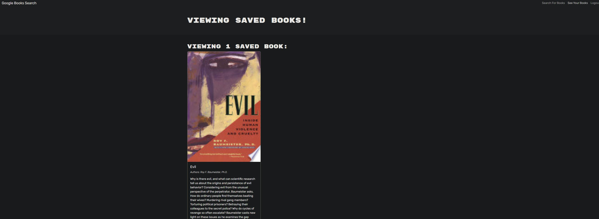

# searchLib

## Description
This is an application demonstrating how to create end deploy an interactive MERN application to save and delete books for a user.

## Installation
Install node.js and then npm install all the requisite packages if using on VScode, or you can use it via deployed link.

## Technologies
Javascript
nodeJS
HTML
CSS
bootstrap
mongodb
mongoose
apollo-server
jwt-decode
jsonwebtoken
bcrypt
express
graphql
NPM
Vite
React
react-router-dom

## Usage
When the user loads the application,  they are met with a search bar to search for books and a link to sign-in and sign-up.  Once the user is registered in the database, the user can then search for book and save them to their account.  The user can then see all the books they saved via the 'see your books' link in the upper right.  

## license
See repository for licensing information 

## Credits
Collaborators include: Alic Madd, Drew Hoang, and Kyle Vance
resources used: MDN, W3 schools, google search

## links

github repo:
https://github.com/RTAKA808/searchLib

screenshot:

demo link:
https://searchlib-1.onrender.com/